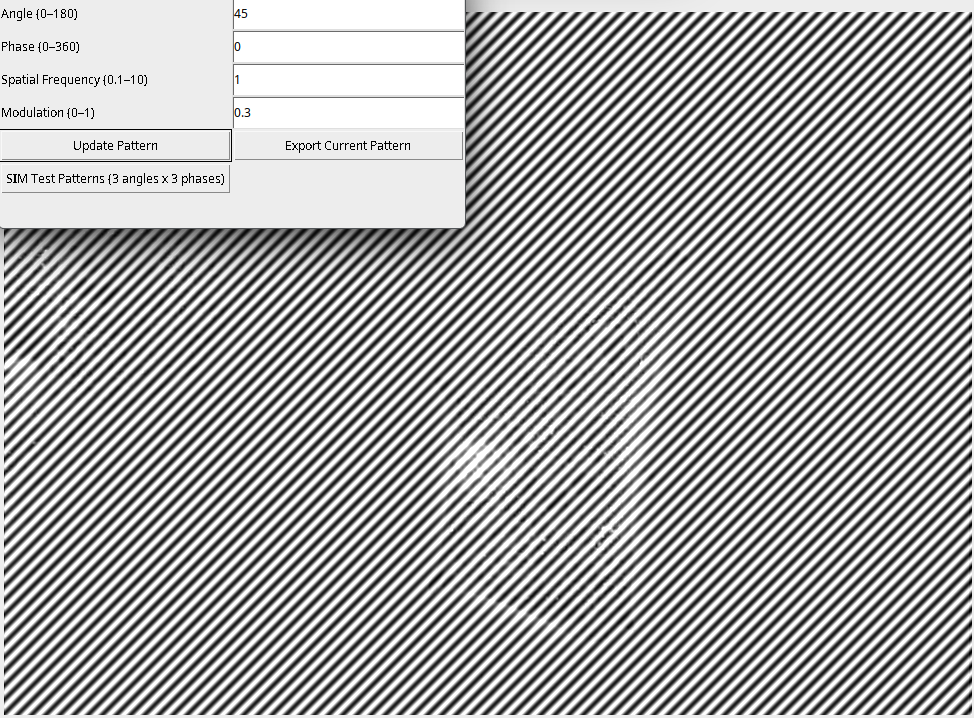

# SIM Pattern Generator

An [ImageJ](https://imagej.net/) plugin for generating and overlaying **Structured Illumination Microscopy (SIM)** interference patterns onto images. Useful for simulating SIM illumination conditions and testing reconstruction pipelines.

---



---

## Table of Contents

- [Overview](#overview)
- [Requirements](#requirements)
- [Installation](#installation)
- [Usage](#usage)
- [Parameters](#parameters)
- [Buttons](#buttons)
- [Output](#output)

---

## Overview

Structured Illumination Microscopy works by projecting sinusoidal interference patterns onto a sample at multiple angles and phases. This plugin lets you:

- Overlay a customizable sinusoidal SIM pattern onto any open ImageJ image
- Interactively tune angle, phase, spatial frequency, and modulation depth
- Export a standalone pattern image for the current settings
- Generate a full 9-image SIM stack (3 angles × 3 phases) suitable for testing SIM reconstruction algorithms

---

## Requirements

- [ImageJ](https://imagej.net/ij/download.html) 1.x **or** [Fiji](https://fiji.sc/) (recommended)
- Java 8 or later (bundled with Fiji)

---

## Installation

1. Download `SIM_Pattern_Tool.java` (or compile it to `SIM_Pattern_Tool.class`).
2. Place the `.java` file in your ImageJ `plugins/` directory.
3. In ImageJ, go to **Plugins → Compile and Run** and select the file, **or** restart ImageJ/Fiji — the plugin will appear under the **Plugins** menu automatically.

> **Tip:** If you are using Fiji, dropping the file into `Fiji.app/plugins/` and restarting is all you need.

---

## Usage

1. Open an image in ImageJ (**File → Open**).
2. Launch the plugin via **Plugins → SIM Pattern Tool**.
3. A control panel appears with editable fields for each parameter.
4. Adjust the values and click **Update Pattern** to preview the overlay on your image.
5. Use the export buttons to save patterns for further analysis.

---

## Parameters

| Parameter | Range | Default | Description |
|---|---|---|---|
| **Angle** | 0 – 180° | 0° | Orientation of the sinusoidal fringe pattern |
| **Phase** | 0 – 360° | 0° | Phase offset of the fringe pattern along its propagation axis |
| **Spatial Frequency** | 0.1 – 10 | 3.5 | Spatial frequency of the fringes (cycles per unit length, where 1 unit = 0.1 µm pixel size) |
| **Modulation** | 0 – 1 | 0.3 | Contrast/depth of the sinusoidal modulation (0 = no pattern, 1 = full contrast) |

The pattern intensity at each pixel is computed as:

```
I(x, y) = 0.5 × (1 + m × cos(2π(kx·X + ky·Y) + φ))
```

where `m` is modulation, `kx`/`ky` are the frequency components along x and y derived from the angle, and `φ` is the phase offset. Coordinates are centered on the image and scaled by the pixel size (0.1 µm/px).

---

## Buttons

### Update Pattern
Recalculates the sinusoidal pattern with the current parameter values and overlays it onto the original image using additive blending. The original image is preserved internally — only the display is modified.

### Export Current Pattern
Generates a standalone 32-bit float grayscale image of the current pattern (without the original image underneath) and opens it as a new ImageJ window titled **"Current SIM Pattern"**.

### SIM Test Patterns (3 angles × 3 phases)
Generates a 9-slice ImageJ stack covering the standard SIM acquisition scheme:

| Slice | Angle | Phase |
|---|---|---|
| 1 | 0° | 0° |
| 2 | 0° | 120° |
| 3 | 0° | 240° |
| 4 | 60° | 0° |
| 5 | 60° | 120° |
| 6 | 60° | 240° |
| 7 | 120° | 0° |
| 8 | 120° | 120° |
| 9 | 120° | 240° |

The stack opens as **"SIM Test Patterns (3 angles × 3 phases)"** and uses the spatial frequency and modulation values currently entered in the panel.

---

## Output

All exported images are 32-bit floating-point processors with values in the range [0, 1], suitable for direct use in SIM reconstruction pipelines or further processing in ImageJ/Fiji.

---
